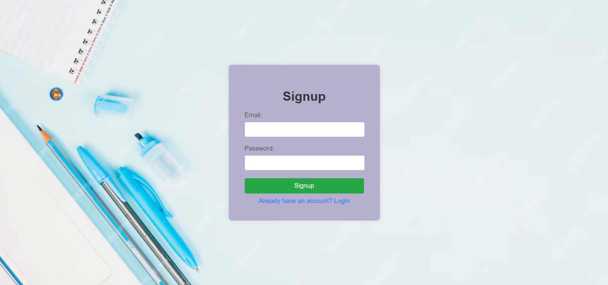
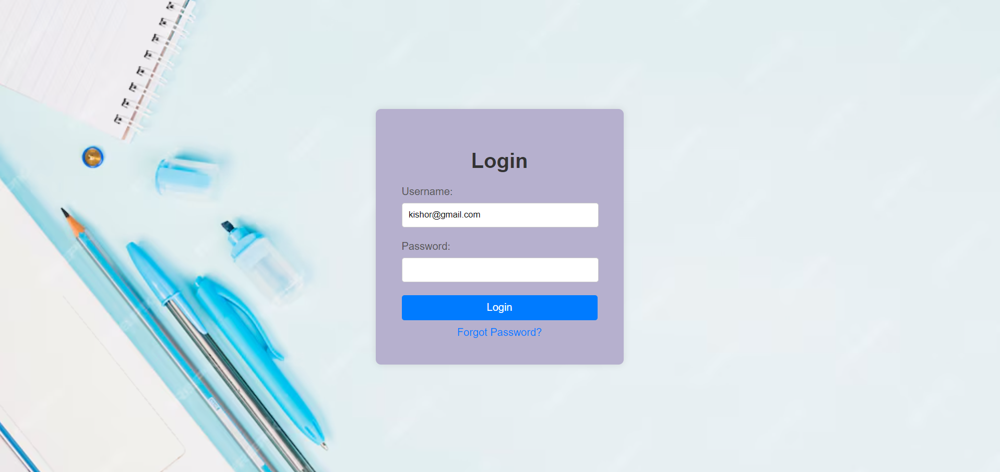
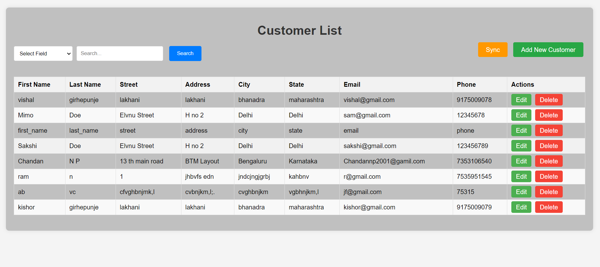
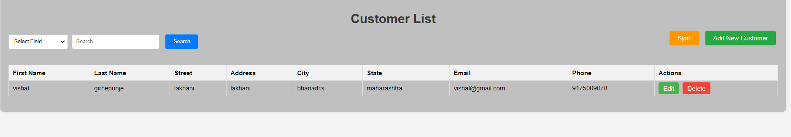
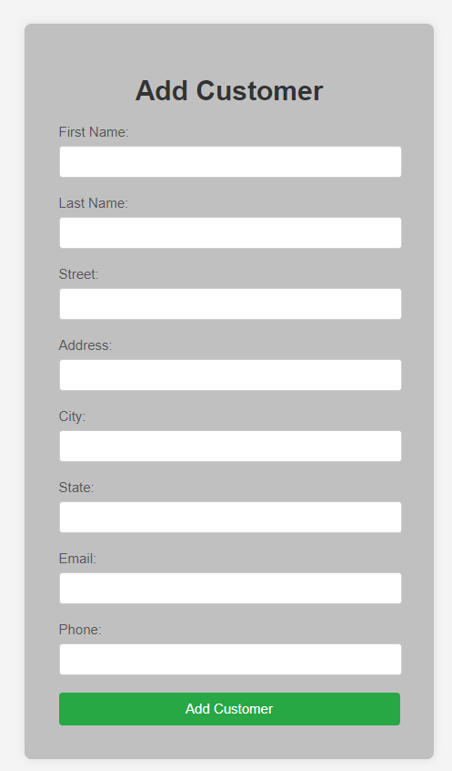
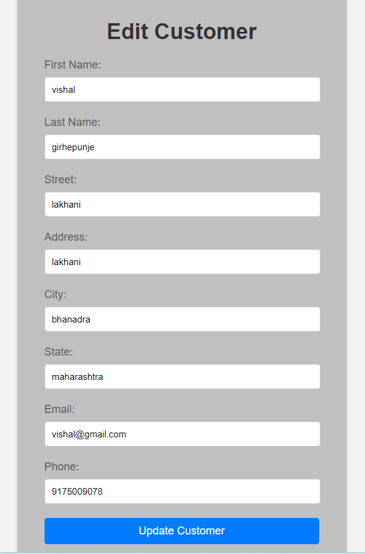

# Customer Management Application

## Overview

The Customer Management Application is a user-friendly CRUD tool designed for managing customer information. Built with MySQL, Spring Boot, and a responsive frontend, this application features robust security with JWT authentication and the ability to synchronize customer data from an external API.

## Features

- **View Customers**: Access and view a list of all customers.
- **Add Customer**: Add new customer records.
- **Edit Customer**: Modify existing customer details.
- **Delete Customer**: Remove customer records.
- **Search**: Find customers by various fields.
- **Data Sync**: Fetch and update customer data from an external API.

## Technologies

- **Database**: MySQL
- **Backend**: Spring Boot
- **Frontend**: HTML, CSS, JavaScript
- **Templating**: Thymeleaf
- **Authentication**: JWT

## Getting Started

To set up and run the application on your local machine, follow these steps:

### Prerequisites

- Java 11 or higher
- MySQL
- Maven

### Installation

1. **Clone the Repository**
    ```sh
    git clone https://github.com/yourusername/customer_App.git
    ```

2. **Navigate to the Project Directory**
    ```sh
    cd customer_App
    ```

3. **Create a MySQL Database**
    ```sql
    CREATE DATABASE Sunbase_Customer_App;
    ```

4. **Configure Database Credentials**

   Update the `application.properties` file with your MySQL database credentials:
    ```properties
    spring.datasource.url=jdbc:mysql://localhost:3306/Sunbase_Customer_App
    spring.datasource.username=root
    spring.datasource.password=root
    ```

5. **Build the Project**
    ```sh
    mvn clean install
    ```

6. **Run the Application**
    ```sh
    mvn spring-boot:run
    ```

## Usage

Once the application is running, access it at `http://localhost:8080`. You can log in with your credentials or sign up to create a new account. Use the navigation menu to explore the application's features.

## Endpoints

- **Authentication**
  - `auth/signup`: Sign up for a new account
  - `auth/login`: Log in to your account
- **Customer Management**
  - `/customers`: List all customers
  - `/customers/new`: Add a new customer
  - `/customers/edit/{id}`: Edit an existing customer
  - `/customers/delete/{id}`: Delete a customer
- **Data Sync**
  - `/api/customers/sync`: Synchronize customer data from an external API

## Screenshots

Below are some screenshots of the application:

### Signup


### Sign In


### Customer List


### Customer Search by(Firs Name, Last Name, Gmail, Cityt, phone Number etc.) List


### Add Customer


### Edit Customer


## Contact

If you have any questions or suggestions, feel free to contact me at [girhepunjevishal@gmail.com](mailto:girhepunjevishal@gmail.com).
